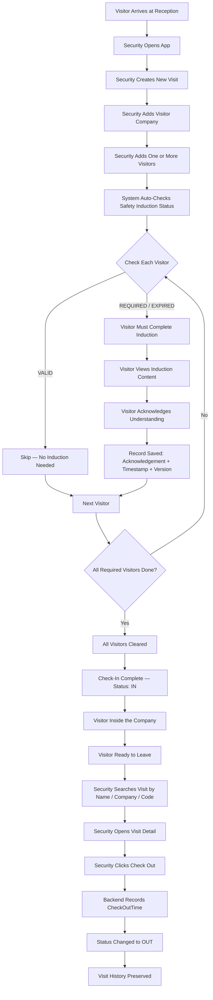
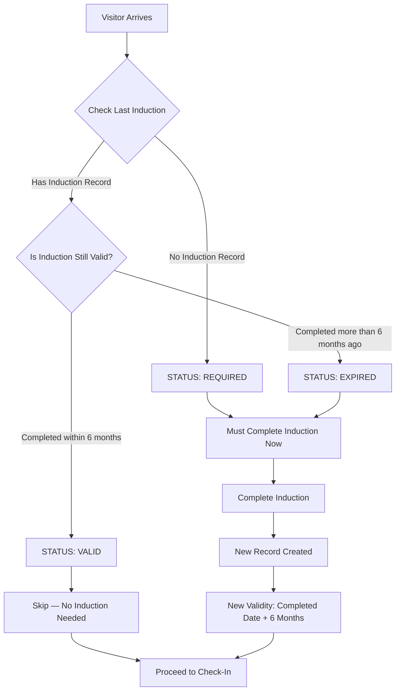
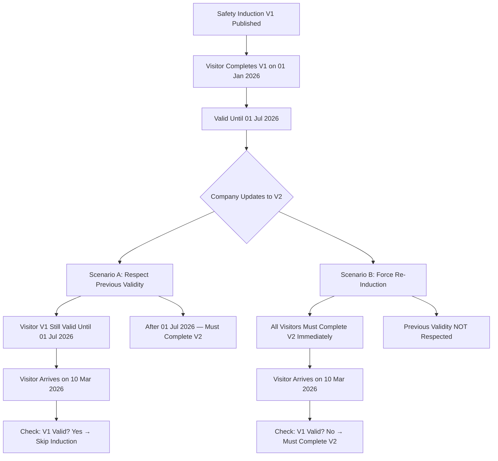
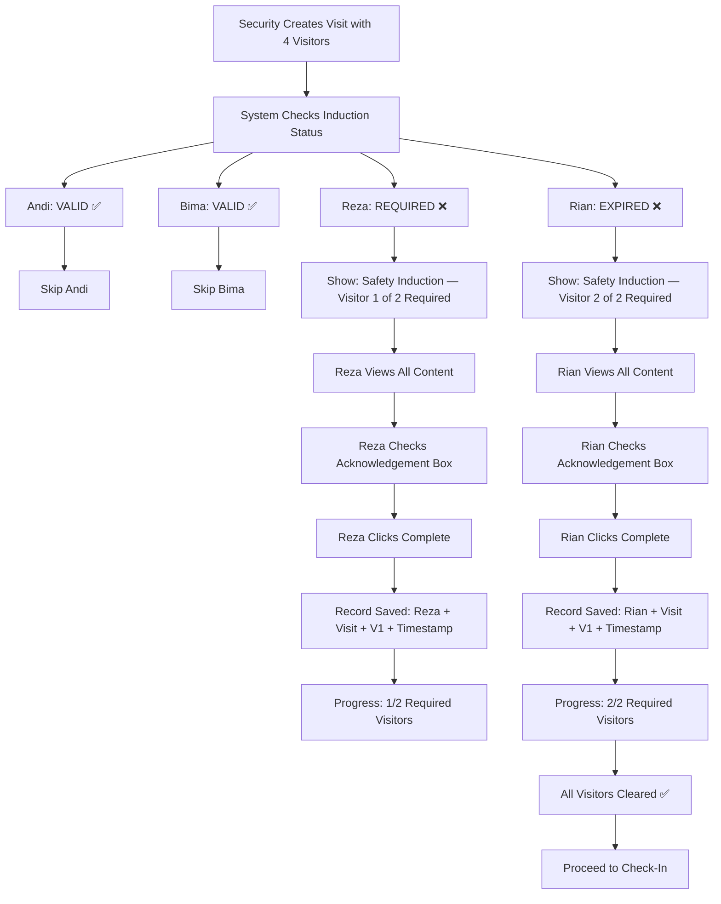
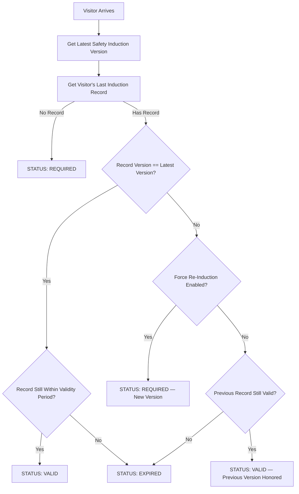
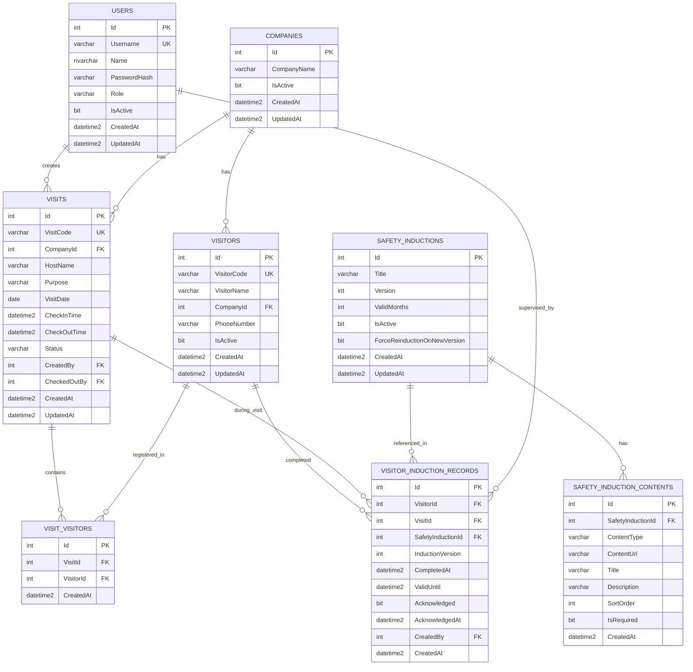
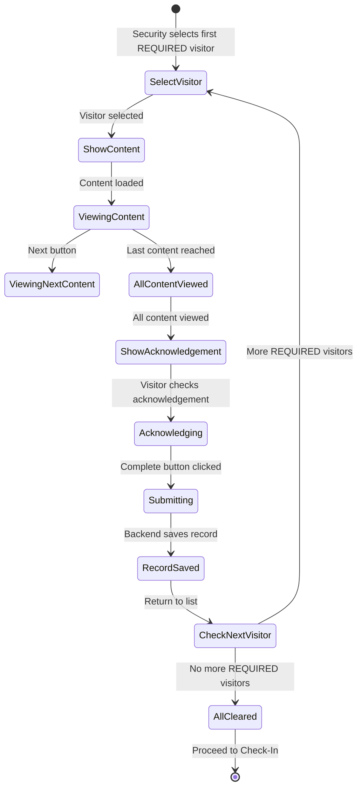

# Visitor Management & Safety Induction System

> **Single Source of Truth** untuk seluruh requirement, desain, dan arsitektur project.

---

## Table of Contents

- [1. Project Overview](#1-project-overview)
- [2. Problem Statement](#2-problem-statement)
- [3. Goals](#3-goals)
- [4. Scope](#4-scope)
- [5. Roles](#5-roles)
- [6. Functional Requirements](#6-functional-requirements)
- [7. Business Rules](#7-business-rules)
- [8. Business Flow](#8-business-flow)
- [9. Safety Induction Flow](#9-safety-induction-flow)
- [10. Visitor Identity & Deduplication](#10-visitor-identity--deduplication)
- [11. Safety Induction Validity & Versioning](#11-safety-induction-validity--versioning)
- [12. Database Design](#12-database-design)
- [13. ERD (Entity Relationship Diagram)](#13-erd-entity-relationship-diagram)
- [14. Backend Architecture](#14-backend-architecture)
- [15. Frontend Architecture](#15-frontend-architecture)
- [16. Dashboard](#16-dashboard)
- [17. Reporting](#17-reporting)
- [18. Security](#18-security)
- [19. Deployment Architecture](#19-deployment-architecture)
- [20. MVP vs Future Scope](#20-mvp-vs-future-scope)
- [21. Development Roadmap](#21-development-roadmap)
- [22. Acceptance Criteria](#22-acceptance-criteria)
- [23. Tech Stack](#23-tech-stack)
- [24. Assumptions](#24-assumptions)
- [25. Open Questions](#25-open-questions)

---

## 1. Project Overview

**Visitor Management & Safety Induction System** adalah aplikasi web internal perusahaan yang mendigitalisasi proses penerimaan visitor dari perusahaan luar.

Aplikasi ini menangani registrasi kunjungan, identitas visitor, Safety Induction individual (dengan video/gambar), validitas berbasis waktu, check-in/check-out, serta audit trail lengkap untuk kepatuhan terhadap prosedur keselamatan.

### Naming

- **Project Name:** Visitor Management & Safety Induction System
- **Short Name:** VM-SIS / Visitor BMC
- **Target IP (Internal):** `10.19.25.29`

---

## 2. Problem Statement

Saat ini proses penerimaan visitor di perusahaan masih dilakukan secara manual:

- Visitor datang, Security mencatat data secara manual di kertas/formulir
- Tidak ada cara untuk mengecek apakah visitor pernah melakukan Safety Induction
- Tidak ada sistem untuk melacak masa berlaku Safety Induction
- Tidak ada cara cepat melihat siapa yang masih berada di area perusahaan
- Tidak ada dokumentasi audit trail yang terstruktur
- Safety Induction sering kali tidak terdokumentasi dengan baik

**Dampak:**
- Risiko keamanan karena visitor tidak terlacak
- Tidak compliant terhadap prosedur keselamatan
- Sulit membuat laporan kunjungan
- Tidak ada riwayat kunjungan yang bisa di-retrieve

---

## 3. Goals

| # | Goal |
|---|------|
| 1 | Mendigitalisasi seluruh proses penerimaan visitor |
| 2 | Memastikan setiap visitor menyelesaikan Safety Induction sebelum masuk area |
| 3 | Mendeteksi otomatis apakah visitor perlu melakukan Safety Induction |
| 4 | Melacak visitor yang masih berada di area perusahaan |
| 5 | Mencatat history kunjungan dan Safety Induction untuk audit |
| 6 | Memastikan Safety Induction berlaku selama 6 bulan dengan versi yang terdokumentasi |
| 7 | Memberikan kemudahan Security dalam melakukan check-in dan check-out |
| 8 | Deployment sederhana menggunakan Docker + Portainer pada jaringan internal |

---

## 4. Scope

### In Scope (MVP)

- Autentikasi untuk role Security
- Manajemen data perusahaan visitor
- Registrasi kunjungan dengan multiple visitors
- Safety Induction individual dengan media (video/gambar)
- Acknowledgement individual per visitor
- Validitas Safety Induction 6 bulan (configurable)
- Versioning Safety Induction
- Smart detection: VALID / REQUIRED / EXPIRED
- Check-in dan check-out
- Halaman Currently Inside
- History kunjungan
- History Safety Induction
- Audit trail
- Deployment Docker + Portainer di jaringan internal

### Out of Scope (Future)

- Public visitor access (`visitor.bmc.co.id`)
- QR registration
- Advanced reporting & Excel export
- Host notification (email/SMS)
- Pre-registration oleh host
- Visitor badge printing
- Email notification
- Advanced admin configuration UI

---

## 5. Roles

### Security

Role utama yang mengoperasikan aplikasi di lokasi penerimaan visitor.

**Capabilities:**

| Action | Description |
|--------|-------------|
| Create Visit | Membuat registrasi kunjungan baru |
| Add Company | Memasukkan nama perusahaan visitor |
| Add Visitors | Memasukkan satu atau banyak visitor per visit |
| View Safety Induction Status | Melihat status Safety Induction masing-masing visitor |
| View Currently Inside | Melihat visitor yang masih berada di area |
| Search Visitor | Mencari visitor berdasarkan nama, perusahaan, visit code |
| Check-Out | Melakukan check-out visitor yang meninggalkan area |
| View Visit History | Melihat riwayat kunjungan |

### Visitor

Visitor hanya berinteraksi dengan sistem melalui halaman Safety Induction.

**Capabilities:**

| Action | Description |
|--------|-------------|
| View Safety Induction | Melihat materi Safety Induction (video/gambar) |
| Acknowledge | Memberikan pernyataan bahwa sudah membaca/menonton dan memahami materi |

Visitor tidak login ke sistem. Mereka berinteraksi melalui perangkat yang disediakan Security.

### Admin (Recommended — Not MVP Priority)

Admin bertanggung jawab mengelola konten dan konfigurasi sistem.

**Capabilities (Future):**

| Action | Description |
|--------|-------------|
| Manage Safety Induction Content | Upload/edit materi Safety Induction |
| Manage Induction Versions | Membuat versi baru Safety Induction |
| Configure Validity Period | Mengubah masa berlaku Safety Induction |
| User Management | Mengelola akun Security |
| View Reports | Melihat laporan kunjungan dan Safety Induction |

> **Catatan:** Untuk MVP, Safety Induction content dapat dikelola melalui seed data atau admin script. Admin UI dapat ditambahkan sebagai enhancement setelah core workflow selesai.

---

## 6. Functional Requirements

### 6.1 Registration Kunjungan

Saat visitor datang, Security membuat satu **Visit**.

**Data minimal Visit:**

| Field | Type | Description |
|-------|------|-------------|
| `VisitCode` | `VARCHAR(20)` | Kode unik, format: `VIS-YYYYMMDD-XXX` |
| `CompanyId` | `FK` | Perusahaan asal visitor |
| `HostName` | `VARCHAR(100)` | Nama host / orang yang ditemui |
| `Purpose` | `VARCHAR(255)` | Tujuan kunjungan (free text) |
| `VisitDate` | `DATE` | Tanggal kunjungan (server-generated) |
| `CheckInTime` | `DATETIME` | Waktu check-in (server-generated) |
| `CheckOutTime` | `DATETIME` | Waktu check-out (server-generated) |
| `Status` | `ENUM` | Status visit: `PENDING`, `IN`, `OUT` |
| `CreatedBy` | `FK` | Security/user yang membuat visit |
| `CreatedAt` | `DATETIME` | Timestamp pembuatan (server-generated) |
| `UpdatedAt` | `DATETIME` | Timestamp update terakhir |

**Format Visit Code:**

```
VIS-20260903-001
│   │         │
│   │         └── Urutan dalam hari (001, 002, ...)
│   └──────────── Tanggal (YYYYMMDD)
└──────────────── Prefix
```

> **Penting:** Tanggal dan waktu check-in harus dibuat oleh **backend/server**, bukan dari browser. Ini mencegah manipulasi waktu.

### 6.2 Multiple Visitors

Satu Visit dapat memiliki banyak visitor.

**Data minimal Visitor (tabel terpisah):**

| Field | Type | Description |
|-------|------|-------------|
| `VisitorId` | `UUID` | ID unik internal |
| `FullName` | `VARCHAR(100)` | Nama lengkap |
| `CompanyId` | `FK` | Perusahaan asal |
| `PhoneNumber` | `VARCHAR(20)` | Nomor telepon (opsional, jika diizinkan perusahaan) |
| `CreatedAt` | `DATETIME` | Timestamp pembuatan |

**Relasi Visit ↔ Visitor (tabel junction):**

| Field | Type | Description |
|-------|------|-------------|
| `VisitVisitorId` | `UUID` | ID unik |
| `VisitId` | `FK` | Relasi ke Visit |
| `VisitorId` | `FK` | Relasi ke Visitor |

> **Catatan:** Jangan membuat satu Visit terpisah untuk setiap visitor. Gunakan relasi Many-to-Many antara Visit dan Visitor.

#### Phase 5 Registration Workflow

Registration menggunakan satu Visit untuk satu Company dan satu atau lebih Visitor:

```
Visit Details -> Visitors -> Safety Check -> Review -> Create Visit
```

Visitor existing dapat dipilih setelah pencarian berdasarkan Company. Visitor baru menjalani duplicate check sebelum dibuat.

`VisitCode` dibuat backend dengan format `VIS-YYYYMMDD-XXX`. Counter harian disimpan di `VisitDailyCounters` dan dibaca/diperbarui di transaction `SERIALIZABLE` dengan `UPDLOCK, HOLDLOCK`; karena itu dua registration bersamaan tidak memperoleh nomor yang sama.

Visit dibuat atomic: insert `Visits` dan seluruh row `VisitVisitors` berada dalam transaction yang sama. Kegagalan pada salah satu link melakukan rollback seluruh registration.

`VisitDate` adalah calendar date bisnis (`DATE`), sedangkan timestamp audit/check-in/out tetap UTC (`SYSUTCDATETIME()`). Registration tidak mengisi `CheckInTime`.

Status lifecycle:

```
PENDING_INDUCTION -> READY_FOR_CHECKIN -> IN -> OUT
          \-> CANCELLED
```

`PENDING_INDUCTION` dipakai bila ada visitor `REQUIRED` atau `EXPIRED`. Safety clearance dihitung saat preview, create, dan detail dari history database, bukan dari client atau `VisitVisitors.SafetyStatus`.

Status clearance:

- `VALID`: record completion masih memiliki `ValidUntil` di masa depan dan policy versi terpenuhi.
- `REQUIRED`: belum pernah selesai, atau versi aktif memaksa re-induction (`NEW_VERSION_REQUIRED`).
- `EXPIRED`: tidak ada record valid dan completion terakhir telah melewati `ValidUntil`.

Jika tidak ada tepat satu Safety Induction aktif, backend mengembalikan configuration error. `ValidMonths` dan `ForceReinductionOnNewVersion` dari database adalah source of truth; environment variable lama tidak digunakan.

### 6.3 Safety Induction

Safety Induction merupakan **requirement utama** aplikasi.

- Setiap visitor harus menyelesaikan Safety Induction **secara individual**
- Materi dapat berupa **video** dan/atau **gambar**
- Dapat memiliki **beberapa materi** dengan **urutan** tertentu
- Setelah menyelesaikan seluruh materi, visitor melakukan **acknowledgement**

**UI Flow:**

```
Safety Induction — Visitor 1 of 4
[Video / Image Content]
[Checkbox] Saya sudah melihat, membaca/menonton, dan memahami Safety Induction yang diberikan.
[Complete Button]
→ 1 / 4 Completed
→ Visitor 2 of 4
→ ... dst
→ All Visitors Cleared
```

### 6.4 Check-In

- Visit tidak dianggap resmi `IN` jika masih ada visitor dengan status `REQUIRED`
- Semua visitor harus memiliki induction `VALID` atau baru saja menyelesaikan induction
- Status Visit berubah: `PENDING` → `IN` hanya setelah **semua visitor cleared**

### 6.5 Currently Inside

Security membutuhkan halaman untuk melihat siapa yang masih berada di area.

**Data yang ditampilkan:**

| Field | Description |
|-------|-------------|
| Visit Code | Kode kunjungan |
| Company | Perusahaan visitor |
| Visitors | Daftar nama visitor |
| Host | Host / orang yang ditemui |
| Purpose | Tujuan kunjungan |
| Check-In Time | Waktu check-in |
| Status | Status visit |
| Safety Status | Status Safety Induction masing-masing visitor |

**Filter/Search:**

| Filter | Description |
|--------|-------------|
| Visitor Name | Cari berdasarkan nama visitor |
| Company | Filter berdasarkan perusahaan |
| Visit Code | Cari berdasarkan kode kunjungan |
| Date | Filter berdasarkan tanggal |
| Host | Filter berdasarkan host |
| Status IN / OUT | Filter berdasarkan status |

### 6.6 Check-Out

Security mencari Visit berdasarkan:
- Visitor Name
- Company
- Visit Code
- Status `IN`

Kemudian membuka detail Visit dan memilih `Check Out`.

**Backend mencatat:**

| Field | Description |
|-------|-------------|
| `CheckOutTime` | Waktu check-out (server-generated) |
| `CheckedOutBy` | Security yang melakukan checkout |
| `Status` | Perubahan: `IN` → `OUT` |

> Visit tidak dihapus setelah checkout. History tetap tersedia.

### 6.7 History

Dua jenis history yang harus disimpan:

#### Visit History

```
Andi — PT ABC

03 September 2026
  Supplier Meeting
  IN 09:20
  OUT 11:42

14 July 2026
  Meeting
  IN 10:11
  OUT 12:03
```

#### Safety Induction History

```
01 January 2026
  Safety Induction V1
  Completed
  Expired 01 July 2026

03 July 2026
  Safety Induction V1
  Completed
  Expired 03 January 2027

10 February 2027
  Safety Induction V2
  Completed
  Valid until 10 August 2027
```

> History lama **tidak boleh dihapus** hanya karena record sudah expired.

---

## 7. Business Rules

| ID | Rule |
|----|------|
| BR-01 | Visit Code di-generate oleh backend dalam format `VIS-YYYYMMDD-XXX` |
| BR-02 | Check-in time dan check-out time di-generate oleh server, bukan browser |
| BR-03 | Safety Induction validity period default **6 bulan**, configurable |
| BR-04 | Visitor dengan Safety Induction `VALID` tidak perlu mengulang induksi |
| BR-05 | Visitor dengan Safety Induction `EXPIRED` atau `REQUIRED` wajib melakukan induksi |
| BR-06 | Status `VALID` berlaku dari tanggal selesai induksi sampai + 6 bulan |
| BR-07 | Safety Induction acknowledgement dicatat per visitor, bukan per visit |
| BR-08 | History Safety Induction tidak boleh dihapus atau di-overwrite |
| BR-09 | Visit baru bisa dianggap `IN` setelah **semua** visitor cleared dari induksi |
| BR-10 | Check-out mengubah status visit dari `IN` ke `OUT` |
| BR-11 | Visit tidak dihapus setelah check-out |
| BR-12 | Setiap Safety Induction memiliki versi |
| BR-13 | Perubahan versi induksi tidak menghapus history versi lama |
| BR-14 | Password user harus di-hash |
| BR-15 | SQL queries harus menggunakan parameterized query |
| BR-16 | Validity period harus configurable, tidak hard-coded di banyak tempat |
| BR-17 | File upload harus divalidasi (tipe file, ukuran) |
| BR-18 | Rate limiting diterapkan pada endpoint login |

---

## 8. Business Flow

### 8.1 Main Flow — Visitor Registration to Check-Out



### 8.2 Safety Induction 6-Month Validity Flow



### 8.3 Safety Induction Versioning Flow



---

## 9. Safety Induction Flow

### 9.1 Individual Visitor Induction Process



### 9.2 Acknowledgement Data

Setiap acknowledgement harus menyimpan minimal data berikut:

| Field | Description |
|-------|-------------|
| Visitor | Visitor yang melakukan induksi |
| Visit | Visit terkait |
| SafetyInduction | Materi induksi yang diselesaikan |
| SafetyInductionVersion | Versi materi induksi |
| CompletedAt | Waktu selesai induksi (server-generated) |
| ValidUntil | Masa berlaku induksi (server-generated) |
| Acknowledged | Pernyataan pemahaman (boolean) |
| AcknowledgedAt | Waktu acknowledgement (server-generated) |
| CreatedBy | Security/User terkait (jika applicable) |
| CreatedAt | Timestamp record dibuat |

> **Catatan:** Data ini diperlukan untuk **audit trail**. Jangan hanya menyimpan `SafetyInductionCompleted = true` di tabel Visitor.

---

## 10. Visitor Identity & Deduplication

### 10.1 Problem

Nama saja tidak cukup untuk mengidentifikasi visitor secara unik:
- Nama bisa sama dengan orang lain
- Nama bisa typo
- Format penulisan bisa berubah

### 10.2 Recommended Identifier Strategy

**Primary Identifier:** Kombinasi `FullName` + `CompanyId` + `PhoneNumber` (opsional)

| Approach | Pros | Cons | Recommendation |
|----------|------|------|----------------|
| Name only | Simple | Duplicates, typos, ambiguous | ❌ Not recommended |
| Name + Company | Better deduplication | Phone can help further | ✅ MVP minimum |
| Name + Company + Phone | Strongest dedup | Collects more PII | ✅ Recommended if allowed |
| ID Card / KTP number | Unique per person | Overkill for visitor mgmt, PII concerns | ❌ Not MVP |

### 10.3 Implementation

- Saat Security menambahkan visitor, sistem mencari kombinasi nama + perusahaan
- Jika ditemukan match → tampilkan suggestion "Apakah ini visitor yang sama?"
- Jika visitor sudah ada → gunakan record yang sudah ada (tidak buat duplikat)
- Jika visitor baru → buat record baru
- Phone number bersifat **opsional** dan hanya dikumpulkan jika diizinkan kebijakan perusahaan

### 10.4 Data Minimization

Hanya kumpulkan data pribadi yang **benar-benar diperlukan** untuk:
- Mengidentifikasi visitor
- Menghubungi dalam keadaan darurat
- Memenuhi kebutuhan audit

> **Catatan:** Phone number opsional. Jika tidak diperlukan, field ini tidak wajib diisi. Lihat bagian Open Questions.

---

## 11. Safety Induction Validity & Versioning

### 11.1 Validity Period

- Default: **6 bulan** dari tanggal selesai induksi
- Harus **configurable** (misal: 12 bulan) tanpa perlu redesign database
- Validity dihitung oleh backend: `CompletedAt + ValidityPeriod`
- Tidak boleh hard-code di banyak tempat source code

### 11.2 Configuration

```typescript
// Contoh konfigurasi (environment variable atau config file)
const SAFETY_INDUCTION_VALIDITY_MONTHS = parseInt(
  process.env.SI_VALIDITY_MONTHS || '6', 
  10
);
```

> Simpan dalam satu tempat, gunakan di seluruh aplikasi.

### 11.3 Versioning

- Setiap Safety Induction memiliki versi (`V1`, `V2`, `V3`, ...)
- Visitor yang telah menyelesaikan V1, jika versi berubah menjadi V2:
  - **Opsi A (Respect Validity):** Visitor tidak perlu mengulang sampai masa berlaku V1 habis
  - **Opsi B (Force Re-Induction):** Semua visitor wajib mengulang induksi V2
- Pilihan ini harus dikonfigurasi, bukan hard-coded
- History induksi lama **tidak boleh dihapus** saat versi berubah

### 11.4 Version Detection Logic



---

## 12. Database Design

### 12.1 Tables Overview

Berikut adalah tabel-tabel utama dalam database:

| Table | Purpose | Primary Key |
|-------|---------|-------------|
| `Users` | Security / Admin accounts | `Id` (INT IDENTITY) |
| `Companies` | Perusahaan asal visitor | `Id` (INT IDENTITY) |
| `Visitors` | Identitas individual visitor | `Id` (INT IDENTITY) |
| `Visits` | Registrasi kunjungan | `Id` (INT IDENTITY) |
| `VisitVisitors` | Junction table: Visit ↔ Visitor | `Id` (INT IDENTITY) |
| `SafetyInductions` | Materi Safety Induction (heading, versi, status) | `Id` (INT IDENTITY) |
| `SafetyInductionContents` | Konten materi (video, gambar, urutan) | `Id` (INT IDENTITY) |
| `VisitorInductionRecords` | History / audit trail Safety Induction per visitor | `Id` (INT IDENTITY) |

Semua primary key menggunakan `INT IDENTITY(1,1)`. Primary key nama kolom adalah `Id`.

### 12.2 Table: `Users`

Menyimpan akun Security dan Admin.

| Column | Type | Constraints | Description |
|--------|------|-------------|-------------|
| `Id` | `INT IDENTITY(1,1)` | PK | ID unik user |
| `Name` | `NVARCHAR(100)` | NOT NULL | Nama lengkap |
| `Username` | `VARCHAR(50)` | UNIQUE, NOT NULL | Username login |
| `PasswordHash` | `VARCHAR(255)` | NOT NULL | Hashed password |
| `Role` | `VARCHAR(20)` | NOT NULL | `SECURITY` / `ADMIN` |
| `IsActive` | `BIT` | NOT NULL, DEFAULT 1 | Status aktif |
| `CreatedAt` | `DATETIME2` | NOT NULL, DEFAULT SYSUTCDATETIME() | Waktu pembuatan (UTC) |
| `UpdatedAt` | `DATETIME2` | NULL | Waktu update terakhir |

### 12.3 Table: `Companies`

Menyimpan perusahaan asal visitor.

| Column | Type | Constraints | Description |
|--------|------|-------------|-------------|
| `Id` | `INT IDENTITY(1,1)` | PK | ID unik perusahaan |
| `CompanyName` | `NVARCHAR(100)` | NOT NULL | Nama perusahaan |
| `IsActive` | `BIT` | NOT NULL, DEFAULT 1 | Status aktif |
| `CreatedAt` | `DATETIME2` | NOT NULL, DEFAULT SYSUTCDATETIME() | Waktu pembuatan (UTC) |
| `UpdatedAt` | `DATETIME2` | NULL | Waktu update terakhir |

### 12.4 Table: `Visitors`

Menyimpan identitas individual visitor. Satu visitor bisa datang berkali-kali.

| Column | Type | Constraints | Description |
|--------|------|-------------|-------------|
| `Id` | `INT IDENTITY(1,1)` | PK | ID unik visitor |
| `VisitorCode` | `VARCHAR(20)` | UNIQUE, NOT NULL | Kode unik: `VST-000001` |
| `VisitorName` | `NVARCHAR(100)` | NOT NULL | Nama lengkap |
| `CompanyId` | `INT` | FK → Companies | Perusahaan asal |
| `PhoneNumber` | `VARCHAR(20)` | NULL | Telepon (opsional) |
| `IsActive` | `BIT` | NOT NULL, DEFAULT 1 | Status aktif |
| `CreatedAt` | `DATETIME2` | NOT NULL, DEFAULT SYSUTCDATETIME() | Waktu pembuatan (UTC) |
| `UpdatedAt` | `DATETIME2` | NULL | Waktu update terakhir |

**Unique Constraint:** `VisitorCode` untuk identifier unik yang human-readable.

### 12.5 Table: `Visits`

Menyimpan registrasi kunjungan.

| Column | Type | Constraints | Description |
|--------|------|-------------|-------------|
| `Id` | `INT IDENTITY(1,1)` | PK | ID unik visit |
| `VisitCode` | `VARCHAR(20)` | UNIQUE, NOT NULL | Kode unik: `VIS-YYYYMMDD-XXX` |
| `CompanyId` | `INT` | FK → Companies | Company visitor |
| `HostName` | `NVARCHAR(100)` | NOT NULL | Orang yang ditemui |
| `Purpose` | `NVARCHAR(255)` | NOT NULL | Tujuan kunjungan |
| `VisitDate` | `DATE` | NOT NULL | Tanggal kunjungan (server-generated) |
| `CheckInTime` | `DATETIME2` | NULL | Waktu check-in (server-generated) |
| `CheckOutTime` | `DATETIME2` | NULL | Waktu check-out (server-generated) |
| `Status` | `VARCHAR(20)` | NOT NULL, DEFAULT 'PENDING_INDUCTION' | `PENDING_INDUCTION` / `IN` / `OUT` / `CANCELLED` |
| `CreatedBy` | `INT` | FK → Users | Security yang membuat |
| `CheckedOutBy` | `INT` | FK → Users, NULL | Security yang checkout |
| `CreatedAt` | `DATETIME2` | NOT NULL, DEFAULT SYSUTCDATETIME() | Waktu pembuatan (UTC) |
| `UpdatedAt` | `DATETIME2` | NULL | Waktu update terakhir |

### 12.6 Table: `VisitVisitors`

Junction table antara Visit dan Visitor (Many-to-Many).

| Column | Type | Constraints | Description |
|--------|------|-------------|-------------|
| `Id` | `INT IDENTITY(1,1)` | PK | ID unik |
| `VisitId` | `INT` | FK → Visits | Relasi ke Visit |
| `VisitorId` | `INT` | FK → Visitors | Relasi ke Visitor |
| `CreatedAt` | `DATETIME2` | NOT NULL, DEFAULT SYSUTCDATETIME() | Waktu pembuatan (UTC) |

**Unique Constraint:** (`VisitId`, `VisitorId`) — satu visitor hanya bisa terdaftar sekali dalam satu visit.

> **Catatan:** `SafetyStatus` (VALID/REQUIRED/EXPIRED) tidak disimpan di tabel ini. Dihitung pada runtime berdasarkan `VisitorInductionRecords` terbaru dan konfigurasi `SafetyInductions` aktif.

### 12.7 Table: `SafetyInductions`

Menyimpan informasi Safety Induction (materi induksi secara umum).

| Column | Type | Constraints | Description |
|--------|------|-------------|-------------|
| `Id` | `INT IDENTITY(1,1)` | PK | ID unik |
| `Title` | `NVARCHAR(200)` | NOT NULL | Judul induksi |
| `Version` | `INT` | NOT NULL, DEFAULT 1 | Versi induksi |
| `ValidMonths` | `INT` | NOT NULL, DEFAULT 6 | Masa berlaku (bulan) |
| `IsActive` | `BIT` | NOT NULL, DEFAULT 1 | Versi ini aktif |
| `ForceReinductionOnNewVersion` | `BIT` | NOT NULL, DEFAULT 0 | Paksa induksi ulang saat versi berubah |
| `CreatedAt` | `DATETIME2` | NOT NULL, DEFAULT SYSUTCDATETIME() | Waktu pembuatan (UTC) |
| `UpdatedAt` | `DATETIME2` | NULL | Waktu update terakhir |

### 12.8 Table: `SafetyInductionContents`

Menyimpan konten materi Safety Induction (video, gambar).

| Column | Type | Constraints | Description |
|--------|------|-------------|-------------|
| `Id` | `INT IDENTITY(1,1)` | PK | ID unik |
| `SafetyInductionId` | `INT` | FK → SafetyInductions | Relasi ke induksi |
| `ContentType` | `VARCHAR(10)` | NOT NULL | `VIDEO` / `IMAGE` |
| `ContentUrl` | `NVARCHAR(500)` | NOT NULL | Path/URL ke file |
| `Title` | `NVARCHAR(200)` | NULL | Judul konten |
| `Description` | `NVARCHAR(1000)` | NULL | Deskripsi |
| `SortOrder` | `INT` | NOT NULL, DEFAULT 0 | Urutan tampilan |
| `IsRequired` | `BIT` | NOT NULL, DEFAULT 1 | Apakah wajib |
| `CreatedAt` | `DATETIME2` | NOT NULL, DEFAULT SYSUTCDATETIME() | Waktu pembuatan (UTC) |

### 12.9 Table: `VisitorInductionRecords`

**Tabel kunci untuk audit trail.** Menyimpan history Safety Induction per visitor.

| Column | Type | Constraints | Description |
|--------|------|-------------|-------------|
| `Id` | `INT IDENTITY(1,1)` | PK | ID unik |
| `VisitorId` | `INT` | FK → Visitors | Visitor yang melakukan induksi |
| `VisitId` | `INT` | FK → Visits | Visit saat induksi dilakukan |
| `SafetyInductionId` | `INT` | FK → SafetyInductions | Versi induksi yang diselesaikan |
| `InductionVersion` | `INT` | NOT NULL | Versi induksi yang diselesaikan |
| `CompletedAt` | `DATETIME2` | NOT NULL, DEFAULT SYSUTCDATETIME() | Waktu selesai induksi (server) |
| `ValidUntil` | `DATETIME2` | NOT NULL | Masa berlaku (server-calculated) |
| `Acknowledged` | `BIT` | NOT NULL, DEFAULT 0 | Pernyataan pemahaman |
| `AcknowledgedAt` | `DATETIME2` | NULL | Waktu acknowledgement (server) |
| `CreatedBy` | `INT` | FK → Users, NULL | Security yang mengawasi induksi (audit, opsional) |
| `CreatedAt` | `DATETIME2` | NOT NULL, DEFAULT SYSUTCDATETIME() | Waktu record dibuat (UTC) |

**Index:** `IX_VIRecords_VisitorId_SafetyInductionId_CompletedAt` untuk query cepat mengecek validitas terakhir.

### 12.10 Configuration

Configuration values are managed at two levels:

1. **Environment variables** — for values that don't change at runtime (JWT_SECRET, DB credentials, etc.)
2. **SafetyInductions.ValidMonths** — configurable per-induction validity period in the database.

The `SI_VALIDITY_MONTHS` and `SI_FORCE_REINDUCTION` environment variables serve as defaults. The actual validity period is stored in the `SafetyInductions` table (`ValidMonths`), allowing per-induction configuration.

---

## 13. ERD (Entity Relationship Diagram)



---

## 14. Backend Architecture

### 14.1 Tech Stack

| Component | Technology |
|-----------|------------|
| Runtime | Node.js |
| Framework | Express.js |
| Language | TypeScript |
| Database | Microsoft SQL Server |
| ORM / Query | `mssql` package atau `typeorm` |
| Authentication | JWT (JSON Web Tokens) |
| File Storage | Local filesystem (server internal) |

### 14.2 API Structure

```
/api/auth/*
/api/visits/*
/api/visitors/*
/api/companies/*
/api/safety-inductions/*
/api/reports/*
/api/config/*
```

### 14.3 Endpoint Planning

#### Auth

| Method | Endpoint | Description |
|--------|----------|-------------|
| POST | `/api/auth/login` | Login user, return JWT |
| POST | `/api/auth/logout` | Invalidate session |
| GET | `/api/auth/me` | Get current user profile |

#### Visits

| Method | Endpoint | Description |
|--------|----------|-------------|
| POST | `/api/visits` | Create new visit (add visitors) |
| GET | `/api/visits` | List visits (with filters) |
| GET | `/api/visits/:id` | Get visit detail |
| GET | `/api/visits/active` | Get currently inside visitors |
| PUT | `/api/visits/:id/checkin` | Process check-in |
| PUT | `/api/visits/:id/checkout` | Process check-out |
| GET | `/api/visits/history` | Get visit history |

#### Visitors

| Method | Endpoint | Description |
|--------|----------|-------------|
| GET | `/api/visitors` | List/search visitors |
| GET | `/api/visitors/:id` | Get visitor detail |
| GET | `/api/visitors/:id/history` | Get visitor visit history |
| GET | `/api/visitors/:id/inductions` | Get visitor induction history |
| GET | `/api/visitors/check-dup` | Check for duplicate visitor |

#### Companies

| Method | Endpoint | Description |
|--------|----------|-------------|
| POST | `/api/companies` | Create new company |
| GET | `/api/companies` | List companies |
| GET | `/api/companies/:id` | Get company detail |
| PUT | `/api/companies/:id` | Update company |

#### Safety Inductions

| Method | Endpoint | Description |
|--------|----------|-------------|
| GET | `/api/safety-inductions` | List active inductions |
| GET | `/api/safety-inductions/:id` | Get induction detail |
| GET | `/api/safety-inductions/:id/contents` | Get induction content (ordered) |
| POST | `/api/safety-inductions/:id/complete` | Submit acknowledgement |
| GET | `/api/safety-inductions/check-status/:visitorId` | Check visitor induction status |
| POST | `/api/safety-inductions` | Create new induction (Admin) |
| PUT | `/api/safety-inductions/:id` | Update induction (Admin) |
| POST | `/api/safety-inductions/:id/contents` | Add content (Admin) |

#### Reports

| Method | Endpoint | Description |
|--------|----------|-------------|
| GET | `/api/reports/visit-history` | Visit history report |
| GET | `/api/reports/induction-records` | Safety Induction records |
| GET | `/api/reports/expired-inductions` | List expired inductions |
| GET | `/api/reports/currently-inside` | Currently inside report |

#### Config

| Method | Endpoint | Description |
|--------|----------|-------------|
| GET | `/api/config` | Get all config |
| PUT | `/api/config/:key` | Update config (Admin) |

### 14.4 Business Logic (Backend-Only)

Fungsi-fungsi berikut **wajib** dilakukan di backend:

| Function | Description |
|----------|-------------|
| Generate Visit Code | Format `VIS-YYYYMMDD-XXX`, auto-increment dalam hari |
| Safety Induction Validity | Hitung `CompletedAt + ValidityMonths` |
| Safety Induction Version Check | Bandingkan versi terakhir visitor dengan versi aktif |
| Check-In Validation | Pastikan semua visitor cleared sebelum check-in |
| Check-Out | Update status, catat waktu check-out |
| Smart Detection | Tentukan `VALID`/`REQUIRED`/`EXPIRED` per visitor |
| Duplicate Detection | Cek kombinasi nama + perusahaan untuk deduplication |
| Server Timestamps | Selalu gunakan waktu server, bukan waktu dari client |

---

## 15. Frontend Architecture

### 15.1 Tech Stack

| Component | Technology |
|-----------|------------|
| Framework | React |
| Language | TypeScript |
| Routing | React Router v6 |
| State Management | React Context / Zustand |
| UI Library | Tailwind CSS / shadcn/ui (rekomendasi) |

### 15.2 Page Structure

| Route | Page | Description |
|-------|------|-------------|
| `/login` | Login | Halaman login Security |
| `/dashboard` | Dashboard | Ringkasan: Visitors Today, Currently Inside, etc. |
| `/visits/new` | New Visit | Form registrasi kunjungan baru |
| `/visits/active` | Active Visits | Daftar visit dengan status `IN` (Currently Inside) |
| `/visits/history` | Visit History | History kunjungan dengan filter |
| `/visits/:id` | Visit Detail | Detail satu visit + status semua visitor |
| `/safety-induction/:visitId` | Safety Induction | Halaman induksi individual per visitor |
| `/visitors/:id` | Visitor Detail | Detail visitor + history kunjungan & induksi |

### 15.3 Safety Induction Page — State & Flow



**Page States:**

| State | Description |
|-------|-------------|
| `SelectVisitor` | Tampilkan daftar visitor yang perlu induksi |
| `ShowContent` | Tampilkan materi induksi satu per satu |
| `Acknowledgement` | Tampilkan checkbox pernyataan pemahaman |
| `Complete` | Simpan record, tampilkan progress |
| `AllCleared` | Semua visitor selesai, lanjut check-in |

**UI Elements:**

- Header: `Safety Induction — Visitor X of Y Required`
- Content: Video player / Image viewer
- Navigation: Previous / Next buttons
- Acknowledgement checkbox: `Saya sudah melihat, membaca/menonton, dan memahami Safety Induction yang diberikan.`
- Progress: `X / Y Required Visitors Completed`
- Button: `Complete` (disabled sampai acknowledgement di-check)
- After completion: `All Visitors Cleared ✅ → Proceed to Check-In`

### 15.4 Routing Protection

| Route | Required Role | Redirect |
|-------|--------------|----------|
| `/login` | None (public on internal) | — |
| `/dashboard` | SECURITY, ADMIN | `/login` |
| `/visits/*` | SECURITY, ADMIN | `/login` |
| `/safety-induction/*` | SECURITY (or kiosk mode) | `/login` |
| `/visitors/*` | SECURITY, ADMIN | `/login` |

---

## 16. Dashboard

Dashboard Security minimal menampilkan:

| Widget | Description |
|--------|-------------|
| Visitors Today | Jumlah visitor yang terdaftar hari ini |
| Currently Inside | Jumlah visitor yang masih di area |
| Checked Out Today | Jumlah visitor yang sudah checkout hari ini |
| Safety Induction Required | Jumlah visitor yang perlu induksi hari ini |

> Jangan membuat dashboard terlalu kompleks pada MVP. Widget tambahan dapat ditambahkan di phase selanjutnya.

---

## 17. Reporting

### 17.1 Report Types

| Report | Description |
|--------|-------------|
| Visit History | Semua kunjungan dengan detail |
| Currently Inside | Visitor yang masih di area |
| Safety Induction Records | Semua record induksi |
| Expired Safety Induction | Visitor dengan induksi expired |
| Visitor History | History kunjungan per visitor |

### 17.2 Export

- **MVP:** View-only di aplikasi
- **Future:** Export ke Excel (.xlsx) untuk laporan berkala

---

## 18. Security

### 18.1 Authentication

| Requirement | Implementation |
|-------------|----------------|
| Password Hashing | bcrypt (12 rounds) |
| Authentication | JWT (JSON Web Tokens) |
| Token Storage | httpOnly cookie |
| Token Expiry | Configurable via `JWT_EXPIRES_IN` (default: 86400 seconds = 24 hours) |
| Rate Limiting | Max 5 attempts per 15 minutes on login |
| Source of Truth | Database validated on every authenticated request |

### 18.2 Authorization

| Role | Access Level |
|------|-------------|
| SECURITY | Visit management, check-in/out, induction flow |
| ADMIN | All SECURITY access + config, user management, master data management |

### 18.3 Data Security

| Requirement | Implementation |
|-------------|----------------|
| SQL Injection | Parameterized queries (never concatenate SQL) |
| Input Validation | Validate all inputs on backend |
| File Upload | Validate file type, size; store outside web root |
| CORS | Restrict to internal network origin |
| Helmet | Use `helmet` middleware for HTTP headers |
| Rate Limiting | Apply to all public-facing endpoints |

### 18.4 Infrastructure Security

| Requirement | Implementation |
|-------------|----------------|
| Internal Network | Application accessible only on internal network |
| No Direct DB Access | SQL Server not exposed to network |
| Secrets Management | Environment variables, never in repository |
| Docker Security | Non-root user, minimal base image |

### 18.5 Audit Trail

| Action | What to Log |
|--------|-------------|
| Safety Induction Complete | Visitor, Visit, Version, Timestamp |
| Check-In | Visit, Timestamp, User |
| Check-Out | Visit, Timestamp, User |
| Login | User, Timestamp, IP |
| Visit Created | Visit, Creator, Timestamp |

### 18.6 Server-Generated Timestamps

Semua timestamp penting **wajib** di-generate oleh backend:

| Timestamp | Generated By |
|-----------|-------------|
| `CreatedAt` | Server |
| `CheckInTime` | Server |
| `CheckOutTime` | Server |
| `CompletedAt` | Server |
| `ValidUntil` | Server (calculated) |
| `AcknowledgedAt` | Server |

> **Tidak boleh** menggunakan waktu dari browser/client untuk event-event di atas.

---

## 19. Deployment Architecture

### 19.1 Current: Internal Network Only

```
┌─────────────────────────────────────────────┐
│              INTERNAL NETWORK                │
│                                              │
│  ┌──────────┐    ┌──────────────────────┐   │
│  │  Browser  │───▶│  Docker (Portainer)   │   │
│  │ (Security │    │                       │   │
│  │  Station) │    │  ┌─────────────────┐  │   │
│  └──────────┘    │  │  Frontend        │  │   │
│                  │  │  (React Build)   │  │   │
│                  │  │  Port: 80/443    │  │   │
│                  │  └────────┬────────┘  │   │
│                  │           │           │   │
│                  │  ┌────────▼────────┐  │   │
│                  │  │  Backend        │  │   │
│                  │  │  (Node+Express) │  │   │
│                  │  │  Port: 3000     │  │   │
│                  │  └────────┬────────┘  │   │
│                  │           │           │   │
│                  └───────────┼───────────┘   │
│                              │               │
│                  ┌───────────▼───────────┐   │
│                  │  SQL Server           │   │
│                  │  (Internal DB)        │   │
│                  │  IP: 10.19.25.27      │   │
│                  │  Port: 1433           │   │
│                  └───────────────────────┘   │
│                                              │
│  Server IP: 10.19.25.29                     │
└─────────────────────────────────────────────┘
```

### 19.2 Docker Compose Structure

```yaml
# docker-compose.yml (conceptual)
version: '3.8'
services:
  frontend:
    build: ./frontend
    ports:
      - "80:80"
    depends_on:
      - backend

  backend:
    build: ./backend
    ports:
      - "3000:3000"
    environment:
      - PORT=3000
      - DB_SERVER=${DB_SERVER}
      - DB_PORT=${DB_PORT}
      - DB_DATABASE=${DB_DATABASE}
      - DB_USER=${DB_USER}
      - DB_PASSWORD=${DB_PASSWORD}
      - JWT_SECRET=${JWT_SECRET}
      - SI_VALIDITY_MONTHS=${SI_VALIDITY_MONTHS}
    depends_on:
      - db

  db:
    image: mcr.microsoft.com/mssql/server:2022-latest
    ports:
      - "1433:1433"
    environment:
      - ACCEPT_EULA=Y
      - SA_PASSWORD=${SA_PASSWORD}
    volumes:
      - sqlserver_data:/var/opt/mssql

volumes:
  sqlserver_data:
```

### 19.3 Environment Variables

```env
# Server
PORT=3000

# Database (SQL Server Internal)
DB_SERVER=10.19.25.27
DB_PORT=1433
DB_DATABASE=BMC
DB_USER=sa
DB_PASSWORD=<USER TO FILL IN>
DB_ENCRYPT=false
DB_TRUST_SERVER_CERTIFICATE=true

# Authentication
JWT_SECRET=<NEVER COMMIT THIS>
JWT_EXPIRES_IN=86400

# Cookie Configuration
COOKIE_SECURE=false  # Set to true in production (HTTPS)
COOKIE_SAME_SITE=lax

# CORS
FRONTEND_URL=http://localhost:5173

# Safety Induction Configuration
SI_VALIDITY_MONTHS=6
SI_FORCE_REINDUCTION=false

# File Upload
UPLOAD_MAX_SIZE_MB=100
UPLOAD_ALLOWED_TYPES=mp4,jpg,jpeg,png,gif

# Rate Limiting
RATE_LIMIT_WINDOW_MS=900000
RATE_LIMIT_MAX_REQUESTS=5
```

> **CRITICAL:** Jangan pernah menaruh password atau credential asli di repository.

### 19.4 Port Mapping

| Service | Internal Port | External Access |
|---------|--------------|-----------------|
| Frontend | 80 | `http://10.19.25.29` |
| Backend | 3000 | Internal only (via frontend proxy) |
| SQL Server | 1433 | Internal only (not exposed) |

### 19.5 Future Public Access

> **Ini hanya future consideration dan bukan scope development saat ini.**

Nantinya, visitor-facing application mungkin dapat diakses melalui:
- Domain: `visitor.bmc.co.id`
- Visitor melakukan registrasi mandiri
- Security/Admin Dashboard tetap internal

Arsitektur hybrid:
```
Internet ──▶ visitor.bmc.co.id (visitor-facing)
Internal ──▶ 10.19.25.29 (security/admin dashboard)
```

**Tidak ada implementasi public access di MVP.**

---

## 20. MVP vs Future Scope

### 20.1 MVP (Minimum Viable Product)

Harus selesai terlebih dahulu sebelum go-live:

| # | Feature | Status |
|---|---------|--------|
| 1 | Authentication Security (JWT) | MVP |
| 2 | Company Management (CRUD) | MVP |
| 3 | Visitor Management (CRUD, dedup) | MVP |
| 4 | Create Visit (multiple visitors) | MVP |
| 5 | Safety Induction (image/video content) | MVP |
| 6 | Individual Acknowledgement | MVP |
| 7 | 6-Month Validity (configurable) | MVP |
| 8 | Induction History / Audit Trail | MVP |
| 9 | Smart Validity Checking | MVP |
| 10 | Check-In Process | MVP |
| 11 | Currently Inside Page | MVP |
| 12 | Check-Out Process | MVP |
| 13 | Visit History | MVP |
| 14 | Basic Search / Filter | MVP |
| 15 | Internal Deployment (Docker + Portainer) | MVP |

### 20.2 Future Scope

| # | Feature | Priority |
|---|---------|----------|
| 1 | Public visitor access (`visitor.bmc.co.id`) | High |
| 2 | QR Code registration | Medium |
| 3 | Advanced reporting & analytics | Medium |
| 4 | Excel export | Medium |
| 5 | Host notification (email/SMS) | Medium |
| 6 | Pre-registration by host | High |
| 7 | Visitor badge printing | Low |
| 8 | Email notification | Medium |
| 9 | Advanced admin configuration UI | Medium |
| 10 | Multi-branch support | Low |
| 11 | Mobile app for security | Low |
| 12 | Integration with access control system | Low |

> **Jangan mencampurkan Future Feature ke implementasi MVP.**

---

## 21. Development Roadmap

### Phase 1 — Project Setup

**Objective:** Setup project structure, tooling, dan development environment.

**Expected Result:**
- Monorepo atau multi-package structure (frontend + backend)
- TypeScript configured
- ESLint, Prettier configured
- Git repository initialized
- README.md (this document) exists

### Phase 2 — Database

**Objective:** Create database schema, seed data, dan connection.

**Expected Result:**
- All tables created (see ERD)
- Foreign keys and indexes defined
- Seed data for test companies
- Database connection working from backend

### Phase 3 — Authentication

**Objective:** Implement login for Security/Admin users.

**Expected Result:**
- Login API endpoint
- JWT generation and validation
- Password hashing (bcrypt)
- Protected routes on backend
- Login page on frontend
- Route protection on frontend

### Phase 4 — Company & Visitor ✅

**Objective:** Implement company and visitor management.

**Completed Result:**
- Company CRUD API with search, pagination, normalization
- Visitor CRUD API with search, pagination, company filter
- Company duplicate detection (case-insensitive, normalized)
- Visitor duplicate detection (strong match: name + company + phone; potential match: name + company)
- VisitorCode generation: `VST-XXXXXX` (backend-side, sequential, safe from concurrency)
- Company list/add/edit pages (ADMIN + SECURITY)
- Visitor list/add/detail/edit pages (ADMIN + SECURITY)
- Soft deactivation via `IsActive` flag
- Unit tests (36 tests, all passing)
- Database migration for indexes (004_company_visitor_indexes.sql)

### Phase 5 — Visit Registration

**Objective:** Implement visit creation with multiple visitors.

**Expected Result:**
- Create Visit API (with Visit Code generation)
- Add multiple visitors to visit
- Smart detection API (VALID / REQUIRED / EXPIRED)
- New Visit form on frontend
- Visit detail page

### Phase 6 — Safety Induction

**Objective:** Implement Safety Induction content and acknowledgement flow.

**Expected Result:**
- Induction content management (CRUD)
- Content viewer page (video/image)
- Individual acknowledgement flow
- Validity calculation (6 months)
- Induction history records
- Version management

### Phase 7 — Check-In / Check-Out

**Objective:** Implement check-in and check-out workflow.

**Expected Result:**
- Check-in validation (all visitors cleared)
- Check-in API
- Check-out API
- Currently Inside page
- Search and filter on Active Visits

### Phase 8 — Dashboard & History

**Objective:** Implement dashboard and history views.

**Expected Result:**
- Dashboard with widgets (Visitors Today, Inside, etc.)
- Visit History page
- Visitor History page
- Basic search and filter

### Phase 9 — Audit & Testing

**Objective:** Ensure audit trail, test coverage, dan edge cases.

**Expected Result:**
- Audit log for all critical actions
- Unit tests for business logic
- Integration tests for API
- Manual testing of full workflow

### Phase 10 — Docker & Portainer Deployment

**Objective:** Deploy application to internal server.

**Expected Result:**
- Dockerfile for frontend and backend
- docker-compose.yml
- Environment variable configuration
- Deployed to Portainer on `10.19.25.29`
- Accessible from internal network

---

## 21A. Phase 4 — Implementation Details

### Company Management

- **Normalization:** Input company names are trimmed and repeated spaces collapsed (`PT   ABC` → `PT ABC`).
- **Duplicate Detection:** Case-insensitive comparison using `LOWER(LTRIM(RTRIM(CompanyName)))`. Applies on create and update (excluding self).
- **Soft Delete:** Companies are deactivated via `IsActive = 0`. No physical delete.
- **Search:** `GET /api/companies?q=...&active=...&page=...&limit=...` with parameterized LIKE queries.

### Visitor Management

- **VisitorCode:** Generated backend-side in format `VST-XXXXXX` (zero-padded sequential). Uses `IDENTITY` value after INSERT, safe from race conditions. Code is immutable after creation.
- **Company Relationship:** Each visitor belongs to one company. Company must be active.
- **Phone Number:** Optional. Normalized by trimming and removing spaces/dashes.
- **Soft Delete:** Visitors are deactivated via `IsActive = 0`. No physical delete.

### Visitor Identity Rules

**VisitorName alone is NOT a unique identifier.**

Visitor identity is determined by a combination of fields:

| Match Level | Fields | Response |
|-------------|--------|----------|
| **Strong Match** | Same normalized name + Same company + Same normalized phone | 409 Conflict — reject creation |
| **Potential Match** | Same normalized name + Same company (phone differs or missing) | 201 Created + `potentialMatches` warning in response |
| **No Match** | Different name or different company | 201 Created normally |

**Example — These are allowed (different people):**

| VisitorName | Company | PhoneNumber |
|-------------|---------|-------------|
| Andi | PT ABC | 081111111 |
| Andi | PT ABC | 082222222 |

**Example — This is rejected (strong duplicate):**

| VisitorName | Company | PhoneNumber |
|-------------|---------|-------------|
| Andi | PT ABC | 081111111 |
| Andi | PT ABC | 081111111 |

### Authorization

| Operation | ADMIN | SECURITY |
|-----------|-------|----------|
| List/Search Companies | ✅ | ✅ |
| View Company | ✅ | ✅ |
| Create Company | ✅ | ✅ |
| Update Company | ✅ | ❌ |
| Deactivate Company | ✅ | ❌ |
| List/Search Visitors | ✅ | ✅ |
| View Visitor | ✅ | ✅ |
| Create Visitor | ✅ | ✅ |
| Update Visitor | ✅ | ❌ |
| Deactivate Visitor | ✅ | ❌ |

### API Endpoints

| Method | Endpoint | Description | Auth |
|--------|----------|-------------|------|
| GET | `/api/companies` | List/search companies with pagination | ALL |
| GET | `/api/companies/search` | Typeahead search companies | ALL |
| GET | `/api/companies/:id` | Get company detail | ALL |
| POST | `/api/companies` | Create company | ALL |
| PUT | `/api/companies/:id` | Update company name | ADMIN |
| PATCH | `/api/companies/:id/status` | Activate/deactivate company | ADMIN |
| GET | `/api/visitors` | List/search visitors with pagination | ALL |
| GET | `/api/visitors/search` | Typeahead search visitors | ALL |
| GET | `/api/visitors/:id` | Get visitor detail with company | ALL |
| POST | `/api/visitors` | Create visitor (returns potential matches) | ALL |
| PUT | `/api/visitors/:id` | Update visitor | ADMIN |
| PATCH | `/api/visitors/:id/status` | Activate/deactivate visitor | ADMIN |

### Frontend Pages

| Route | Page | Access |
|-------|------|--------|
| `/companies` | Company list with search | ADMIN + SECURITY |
| `/companies/new` | Add company form | ADMIN + SECURITY |
| `/companies/:id/edit` | Edit company form | ADMIN |
| `/visitors` | Visitor list with search + company filter | ADMIN + SECURITY |
| `/visitors/new` | Add visitor form (with company typeahead) | ADMIN + SECURITY |
| `/visitors/:id` | Visitor detail view | ALL |
| `/visitors/:id/edit` | Edit visitor form | ADMIN |

### Database Migration

`004_company_visitor_indexes.sql` adds:
- `IX_Visitors_PhoneNumber` — filtered index for non-NULL phone numbers
- `IX_Companies_CompanyName_IsActive` — composite index for name+active search
- `IX_Visitors_Name_Company` — composite index for duplicate detection

---

## 22. Acceptance Criteria

### 22.1 Visit Registration

- [ ] Security dapat membuat Visit dengan 4 visitor
- [ ] Visit Code di-generate dalam format `VIS-YYYYMMDD-XXX`
- [ ] Tanggal dan waktu check-in menggunakan waktu server

### 22.2 Safety Induction Detection

- [ ] Sistem dapat mendeteksi 2 visitor memiliki induction VALID dan 2 REQUIRED
- [ ] Hanya 2 visitor REQUIRED yang menjalankan induksi
- [ ] Progress menampilkan `0 / 2 Required Visitors` (bukan `0 / 4`)

### 22.3 Individual Acknowledgement

- [ ] Masing-masing visitor memberikan acknowledgement sendiri
- [ ] Sistem menyimpan waktu dan versi induksi
- [ ] Acknowledgement tersimpan sebagai audit trail, bukan boolean di tabel visitor

### 22.4 Validity & Versioningo

- [ ] Visitor dengan induction valid tidak perlu mengulang dalam 6 bulan
- [ ] Visitor expired wajib melakukan induction ulang
- [ ] History induksi lama tetap tersimpan

### 22.5 Check-In

- [ ] Visit dapat menjadi `IN` setelah seluruh visitor cleared
- [ ] Security tidak bisa check-in jika masih ada visitor `REQUIRED`

### 22.6 Currently Inside

- [ ] Security dapat menemukan visitor yang masih `IN`
- [ ] Filter berdasarkan nama, perusahaan, visit code, tanggal, host

### 22.7 Check-Out

- [ ] Security dapat checkout Visit
- [ ] `CheckOutTime` tercatat dengan waktu server
- [ ] History Visit tetap tersedia setelah `OUT`

---

## 23. Tech Stack

| Layer | Technology | Version |
|-------|-----------|---------|
| Frontend | React | 18+ |
| Frontend Language | TypeScript | 5+ |
| UI Framework | Tailwind CSS / shadcn/ui | Latest |
| Routing | React Router | v6 |
| Backend | Node.js | 20 LTS |
| Backend Framework | Express.js | 4.x |
| Backend Language | TypeScript | 5+ |
| Database | Microsoft SQL Server | 2019+ |
| DB Driver | `mssql` / `typeorm` | Latest |
| Authentication | JWT (`jsonwebtoken`) | Latest |
| Password Hash | bcrypt | Latest |
| Container | Docker | Latest |
| Orchestration | Docker Compose | v3.8+ |
| Management | Portainer | Latest |

---

## 24. Assumptions

| # | Assumption |
|---|------------|
| A1 | SQL Server sudah tersedia di environment internal |
| A2 | Docker dan Portainer sudah ter-install di server target |
| A3 | Server `10.19.25.29` dapat diakses dari jaringan internal |
| A4 | Browser yang digunakan Security adalah browser modern (Chrome/Edge) |
| A5 | Koneksi internet tidak diperlukan untuk operasi harian |
| A6 | File upload (video/gambar) disimpan di server lokal, bukan cloud |
| A7 | Visitor tidak memiliki akun login — mereka berinteraksi melalui perangkat Security |
| A8 | Phone number visitor bersifat opsional |
| A9 | Satu perusahaan visitor bisa memiliki banyak visitor seiring waktu |
| A10 | Safety Induction content di-upload/dikelola oleh Admin (atau via seed data untuk MVP) |

---

## 25. Open Questions

| # | Question | Impact | Status |
|---|----------|--------|--------|
| OQ-1 | Apakah phone number visitor wajib atau opsional? | Menentukan field requirement dan dedup strategy | **Open** |
| OQ-2 | Apakah ada role Admin di MVP, atau cukup Security saja? | Menentukan scope user management | **Open** |
| OQ-3 | Bagaimana Safety Induction content di-upload? Seed data atau admin UI? | Menentukan MVP scope untuk content management | **Open** |
| OQ-4 | Apakah video Safety Induction disimpan di server atau di-stream dari external? | Menentukan file storage strategy | **Open** |
| OQ-5 | Batasan ukuran file upload video/gambar? | Menentukan validation rules | **Open** |
| OQ-6 | Apakah host (orang yang ditemui) adalah user yang terdaftar di sistem, atau cukup free text nama? | Menentukan data model host | **Open** |
| OQ-7 | Apakah diperlukan multiple login session untuk Security? | Menentukan session management strategy | **Open** |
| OQ-8 | Apakah Safety Induction content di-host di luar negeri atau harus local? (Compliance) | Menentukan file storage location | **Open** |
| OQ-9 | Bagaimana behavior jika visitor datang tapi Safety Induction content belum di-upload? | Menentukan error handling | **Open** |
| OQ-10 | Apakah diperlukan dark mode / theming untuk dashboard? | UI scope question | **Open** |
| OQ-11 | Berapa concurrent user yang diharapkan? | Menentukan scaling strategy | **Open** |
| OQ-12 | Apakah SQL Server menggunakan Windows Authentication atau SQL Authentication? | Menentukan DB connection config | **Open** |

---

## Database Setup

### 1. Create Database

Buat database di SQL Server instance Anda:

```sql
CREATE DATABASE BMC;
GO
USE BMC;
GO
```

### 2. Run Initial Schema

Jalankan file schema di `backend/database/001_initial_schema.sql`:

```bash
# Using sqlcmd
sqlcmd -S localhost -U sa -P <your_password> -d BMC -i backend/database/001_initial_schema.sql

# Or using SSMS (SQL Server Management Studio):
# 1. Open the file backend/database/001_initial_schema.sql
# 2. Execute the entire script
```

### 3. Run Development Seed (optional)

Seed data hanya untuk development - menyiapkan Safety Induction V1 dengan konten contoh:

```bash
sqlcmd -S localhost -U sa -P <your_password> -d BMC -i backend/database/002_seed_development.sql
```

### 4. Configure Environment

Copy example env file dan isi dengan konfigurasi Anda:

```bash
cp backend/.env.example backend/.env
```

Edit `backend/.env`:

```env
PORT=3000

# Database (SQL Server)
DB_SERVER=localhost
DB_PORT=1433
DB_DATABASE=BMC
DB_USER=sa
DB_PASSWORD=<YOUR_DB_PASSWORD>
DB_ENCRYPT=false
DB_TRUST_SERVER_CERTIFICATE=true

# Authentication (replace with strong random secret)
JWT_SECRET=<GENERATE_A_STRONG_RANDOM_SECRET>
JWT_EXPIRES_IN=86400

# Cookie Configuration
COOKIE_SECURE=false
COOKIE_SAME_SITE=lax

# CORS
FRONTEND_URL=http://localhost:5173
```

> **IMPORTANT:** Generate JWT_SECRET yang kuat:
> ```bash
> node -e "console.log(require('crypto').randomBytes(64).toString('hex'))"
> ```

### 5. Start Backend

```bash
npm run dev:backend
```

Atau untuk production:

```bash
npm run build:backend
npm start
```

### 6. Test Health Endpoint

Verifikasi backend dan database terhubung:

```bash
curl http://localhost:3000/api/health
```

Response sukses:

```json
{
  "status": "ok",
  "database": "connected"
}
```

HTTP status `200`.

Jika database tidak dapat dihubungi:

```json
{
  "status": "error",
  "database": "disconnected"
}
```

HTTP status `503`.

### 7. Create Initial Admin User

Setelah backend berjalan, buat pengguna ADMIN pertama:

```bash
npm run create-admin --workspace=backend
```

Atau dengan argumen:

```bash
npm run create-admin --workspace=backend -- --name "Admin User" --username admin --password "your_password"
```

---

## Database Schema

Refer ke `backend/database/001_initial_schema.sql` untuk implementasi penuh.

### Tables Overview

| Table | Purpose | Primary Key |
|-------|---------|-------------|
| `Users` | Security / Admin accounts | `Id` (INT IDENTITY) |
| `Companies` | Perusahaan asal visitor | `Id` (INT IDENTITY) |
| `Visitors` | Identitas individual visitor | `Id` (INT IDENTITY) |
| `Visits` | Registrasi kunjungan | `Id` (INT IDENTITY) |
| `VisitVisitors` | Junction table: Visit ↔ Visitor | `Id` (INT IDENTITY) |
| `SafetyInductions` | Materi Safety Induction | `Id` (INT IDENTITY) |
| `SafetyInductionContents` | Konten materi (video/gambar) | `Id` (INT IDENTITY) |
| `VisitorInductionRecords` | History / audit trail | `Id` (INT IDENTITY) |

### Relationships (Foreign Keys)

| From Table | Column | → To Table | Column | Constraint Name |
|------------|--------|------------|--------|-----------------|
| `Visitors` | `CompanyId` | `Companies` | `Id` | `FK_Visitors_Companies` |
| `Visits` | `CompanyId` | `Companies` | `Id` | `FK_Visits_Companies` |
| `Visits` | `CreatedBy` | `Users` | `Id` | `FK_Visits_CreatedBy` |
| `Visits` | `CheckedOutBy` | `Users` | `Id` | `FK_Visits_CheckedOutBy` |
| `VisitVisitors` | `VisitId` | `Visits` | `Id` | `FK_VisitVisitors_Visits` |
| `VisitVisitors` | `VisitorId` | `Visitors` | `Id` | `FK_VisitVisitors_Visitors` |
| `SafetyInductionContents` | `SafetyInductionId` | `SafetyInductions` | `Id` | `FK_SICContents_SafetyInductions` |
| `VisitorInductionRecords` | `VisitorId` | `Visitors` | `Id` | `FK_VIRecords_Visitors` |
| `VisitorInductionRecords` | `VisitId` | `Visits` | `Id` | `FK_VIRecords_Visits` |
| `VisitorInductionRecords` | `SafetyInductionId` | `SafetyInductions` | `Id` | `FK_VIRecords_SafetyInductions` |
| `VisitorInductionRecords` | `CreatedBy` | `Users` | `Id` | `FK_VIRecords_CreatedBy` |

### Constraints Summary

| Table | Type | Constraints |
|-------|------|-------------|
| `Users` | UNIQUE | `UQ_Users_Username` |
| `Users` | CHECK | `CK_Users_Role` — Role must be `ADMIN` or `SECURITY` |
| `Visitors` | UNIQUE | `UQ_Visitors_VisitorCode` |
| `Visits` | UNIQUE | `UQ_Visits_VisitCode` |
| `Visits` | CHECK | `CK_Visits_Status` — Status must be `PENDING_INDUCTION`, `IN`, `OUT`, `CANCELLED` |
| `VisitVisitors` | UNIQUE | `UQ_VisitVisitors_Visit_Visitor` — Prevents duplicate visitor in same visit |
| `SafetyInductionContents` | CHECK | `CK_SICContents_ContentType` — ContentType must be `IMAGE` or `VIDEO` |
| `SafetyInductions` | CHECK | `CK_SafetyInductions_Version` — Version > 0 |
| `SafetyInductions` | CHECK | `CK_SafetyInductions_ValidMonths` — ValidMonths > 0 |
| `VisitorInductionRecords` | CHECK | `CK_VIRecords_InductionVersion` — InductionVersion > 0 |
| `VisitorInductionRecords` | FOREIGN KEY | `FK_VIRecords_CreatedBy` — References Users (auditable, nullable) |

### Default Values

| Table | Column | Default |
|-------|--------|---------|
| `Users` | `IsActive` | `1` |
| `Users` | `CreatedAt` | `SYSUTCDATETIME()` |
| `Companies` | `IsActive` | `1` |
| `Companies` | `CreatedAt` | `SYSUTCDATETIME()` |
| `Visitors` | `IsActive` | `1` |
| `Visitors` | `CreatedAt` | `SYSUTCDATETIME()` |
| `Visits` | `Status` | `'PENDING_INDUCTION'` |
| `Visits` | `CreatedAt` | `SYSUTCDATETIME()` |
| `VisitVisitors` | `CreatedAt` | `SYSUTCDATETIME()` |
| `SafetyInductions` | `Version` | `1` |
| `SafetyInductions` | `ValidMonths` | `6` |
| `SafetyInductions` | `IsActive` | `1` |
| `SafetyInductions` | `ForceReinductionOnNewVersion` | `0` |
| `SafetyInductions` | `CreatedAt` | `SYSUTCDATETIME()` |
| `SafetyInductionContents` | `SortOrder` | `0` |
| `SafetyInductionContents` | `IsRequired` | `1` |
| `SafetyInductionContents` | `CreatedAt` | `SYSUTCDATETIME()` |
| `VisitorInductionRecords` | `Acknowledged` | `0` |
| `VisitorInductionRecords` | `CompletedAt` | `SYSUTCDATETIME()` |
| `VisitorInductionRecords` | `CreatedBy` | `NULL` |
| `VisitorInductionRecords` | `CreatedAt` | `SYSUTCDATETIME()` |

### Timestamp Strategy

All timestamps in the database are stored in UTC using `SYSUTCDATETIME()`. This ensures:

- Consistent time across distributed deployments
- No issues with daylight saving time transitions
- Server-generated timestamps cannot be manipulated by the client

Critical server-generated timestamps:

| Timestamp | Generated By |
|-----------|-------------|
| `CreatedAt` (all tables) | Server |
| `VisitDate` | Server |
| `CheckInTime` | Server |
| `CheckOutTime` | Server |
| `CompletedAt` | Server |
| `ValidUntil` | Server (calculated) |
| `AcknowledgedAt` | Server |

### Design Decisions

#### 1. VisitVisitors.SafetyStatus — Computed At Runtime

The `SafetyStatus` (VALID / REQUIRED / EXPIRED) is **not stored** in `VisitVisitors`.

**Rationale:**
- It depends on the latest `VisitorInductionRecords` entry and current `SafetyInductions` configuration.
- Storing it would create a **duplicate source of truth**.
- It would require constant synchronization whenever induction records change.
- The same visitor might show different statuses depending on `ForceReinductionOnNewVersion` and `ValidMonths` configuration.
- Status is a **query-time computation**, not a stored state.

#### 2. Safety Induction Validity — Database Supported, Logic in Backend

- `SafetyInductions.ValidMonths` stores the validity period (default: 6 months).
- `ValidUntil` in `VisitorInductionRecords` is server-calculated when induction is completed.
- The 6-month default is **configurable per induction** via `ValidMonths`, not hardcoded.

#### 3. Delete Strategy — Soft Delete via IsActive

- `Users`, `Companies`, and `Visitors` use `IsActive` flag instead of physical delete.
- Master data is preserved for audit purposes.
- No `CASCADE DELETE` is used — history tables retain all records.

#### 4. Induction Version Acknowledgment History

- `VisitorInductionRecords` stores `InductionVersion` to track which version of the Safety Induction was completed.
- Old records are **never overwritten** — each completion creates a new record.
- This supports the versioning flow where changing the induction version may force re-induction.

#### 5. SafetyInductionContents

- Uses `ContentUrl` (file path/URL) rather than storing binary data in the database.
- `ContentType` is constrained to `IMAGE` or `VIDEO` via CHECK constraint.
- `IsRequired` flag allows marking individual content items as required or optional.

---

## Authentication

### Auth Flow

```
Login Request
  → backend validates credentials (parameterized SQL, bcrypt compare)
  → JWT generated (userId, role)
  → stored in httpOnly cookie
  → browser sends cookie automatically on subsequent requests
  → /auth/me resolves current user from database (source of truth)
```

### JWT Configuration

| Variable | Default | Description |
|----------|---------|-------------|
| `JWT_SECRET` | — | Secret key for signing tokens (required) |
| `JWT_EXPIRES_IN` | `86400` | Token expiry in seconds (24 hours) |

Generate a strong secret:
```bash
node -e "console.log(require('crypto').randomBytes(64).toString('hex'))"
```

### Cookie Configuration

| Variable | Default | Description |
|----------|---------|-------------|
| `COOKIE_SECURE` | `false` | Set `true` in production (HTTPS only) |
| `COOKIE_SAME_SITE` | `lax` | `lax`, `strict`, or `none` |

Cookie attributes:
- `httpOnly: true` — JavaScript cannot access the cookie
- `secure` — configurable via `COOKIE_SECURE` env var
- `sameSite` — configurable via `COOKIE_SAME_SITE` env var
- `path: /` — available to all routes
- `maxAge` — matches JWT expiry

Frontend never reads JWT directly — relies on browser cookie.

### CORS

| Variable | Default | Description |
|----------|---------|-------------|
| `FRONTEND_URL` | `http://localhost:5173` | Allowed CORS origin |

`credentials: true` is enabled to allow cookie-based auth.

### Password Hashing

- Package: `bcrypt` (native addon)
- Cost factor: `12` rounds
- Password hash is never:
  - Returned in API responses
  - Logged to console
  - Stored in plain text

### Initial User Creation

Use the create-admin script to bootstrap an ADMIN user:

```bash
# Interactive mode
npm run create-admin --workspace=backend

# Or with arguments
npm run create-admin --workspace=backend -- --name "Admin User" --username admin --password "your_password"
```

The script:
1. Prompts for name, username, and password (or accepts CLI args)
2. Checks if username already exists
3. Hashes password with bcrypt (12 rounds)
4. Inserts user with `ADMIN` role

### API Endpoints

| Method | Endpoint | Auth | Description |
|--------|----------|------|-------------|
| POST | `/api/auth/login` | Public | Login with username + password, sets JWT cookie |
| POST | `/api/auth/logout` | Public | Clears JWT cookie |
| GET | `/api/auth/me` | Required | Returns current user profile |
| GET | `/api/health` | Public | Health check (Express + DB) |

### Login Response

```json
{
  "user": {
    "id": 1,
    "name": "Admin User",
    "username": "admin",
    "role": "ADMIN"
 
}
```

`PasswordHash` is never included in any response.

### Error Responses

| Condition | HTTP Status | Message |
|-----------|-------------|---------|
| Missing fields | 400 | "Username and password are required" |
| Invalid credentials | 401 | "Invalid username or password" |
| Inactive user | 401 | "Invalid username or password" |
| No token | 401 | "Authentication required" |
| Expired/invalid token | 401 | "Invalid or expired token" |
| Forbidden role | 403 | "Insufficient permissions" |

Login does not differentiate between "user not found" and "wrong password" — both return the same generic error.

### Roles & Permissions

| Feature | SECURITY | ADMIN |
|---------|---------|-------|
| Login | Yes | Yes |
| View own profile | Yes | Yes |
| Create Visit | Yes | Yes |
| Check-in | Yes | Yes |
| Check-out | Yes | Yes |
| View Visit History | Yes | Yes |
| View Active Visits | Yes | Yes |
| Manage Users | No | Yes |
| Manage Safety Induction | No | Yes |
| Manage Master Data | No | Yes |

### Backend Authorization

Two middleware protect routes:

**`authenticate`** — Reads JWT from httpOnly cookie, verifies token, looks up user in database (source of truth), attaches user identity to request.

**`authorize(...roles)`** — Checks if the authenticated user's role is in the allowed list. Usage:
```typescript
app.get('/api/admin-only', authenticate, authorize('ADMIN'), handler);
```

Database is the source of truth for user active status and role. If a user is deactivated after JWT issuance, subsequent requests are rejected.

---

## License

Internal use only — PT BMC.

---

> **Document Version:** 1.0
> **Last Updated:** 03 September 2026
> **Author:** AI Assistant (generated based on requirement document)
> **Status:** DRAFT — Awaiting review and Open Questions resolution
